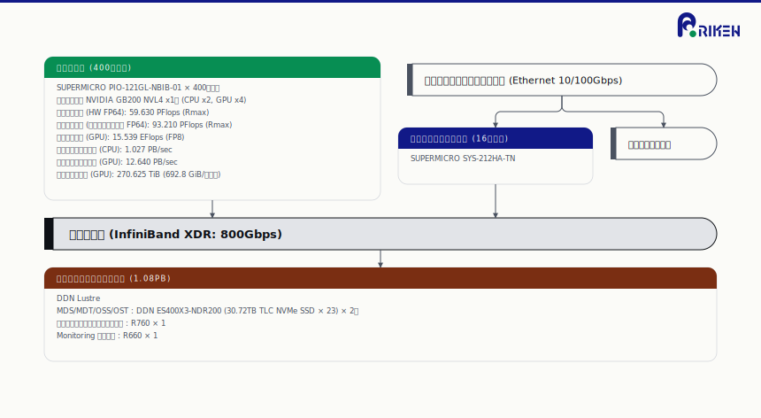
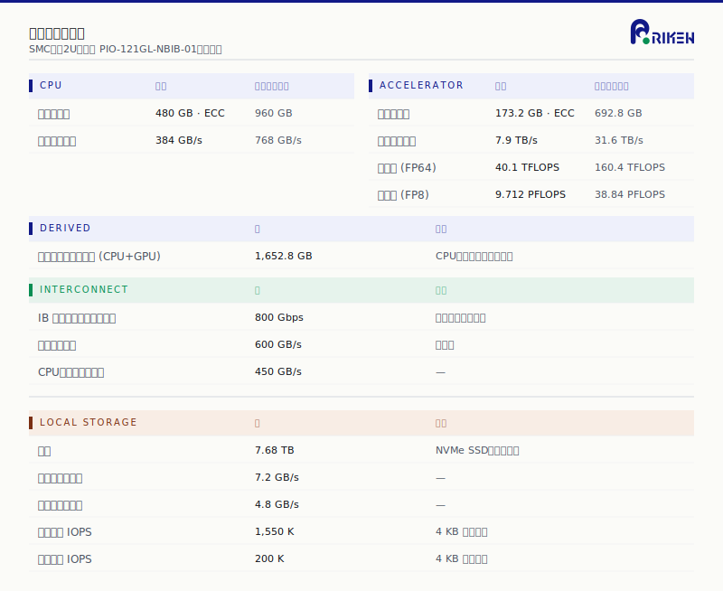
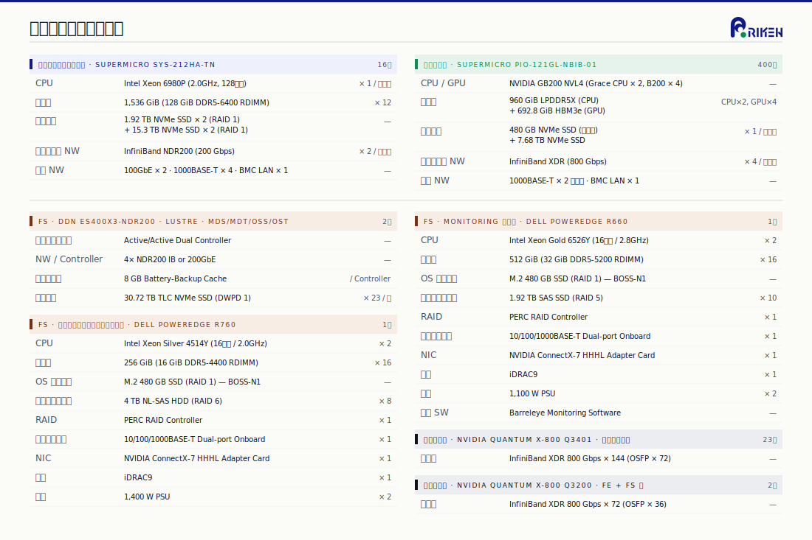
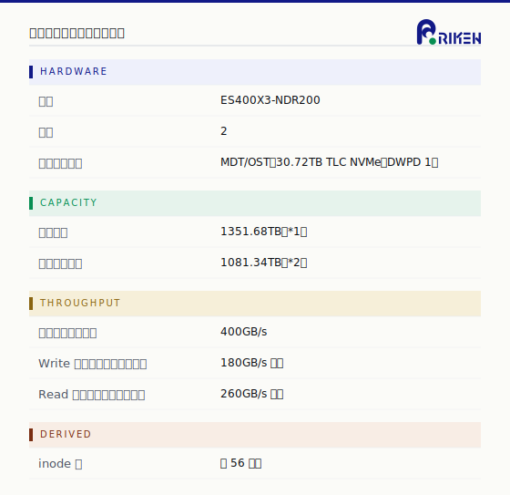
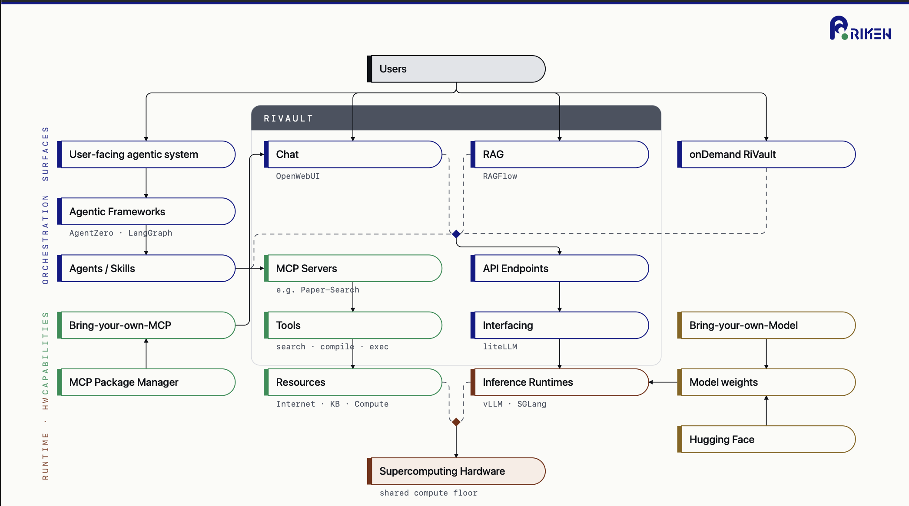

# AI for Science Supercomputer

This landing page provides an overview of the **AI for Science Supercomputer** —
a new RIKEN R-CCS computing platform dedicated to large-scale AI for Science
research, including LLM pre-training, agentic workflows, surrogate modeling,
and inference services. It aggregates publicly available information,
software, and documentation. More elaborate details will be accessible to
users who passed the expert control screening.

The system is provisioned alongside [Fugaku](https://github.com/RIKEN-RCCS/Fugaku)
to give users a continuum of CPU-optimized HPC and GPU-accelerated AI workloads.

> **Status:** This page is under active development; sections marked _TBA_ will
> be populated as procurement progresses and operational documentation matures.

---

## Table of Contents

- [Overview](#overview)
- [System Pipeline](#system-pipeline)
- [Compute Node](#compute-node)
- [Hardware Specifications](#hardware-specifications)
- [Storage](#storage)
- [Software Atlas](#software-atlas)
- [AI Inference Gateway: RiVault](#ai-inference-gateway-rivault)
- [Account / Time Application](#account--time-application)
- [Documentation](#documentation)
- [Support / Contact](#support--contact)
- [Related Repositories](#related-repositories)

---

## Overview

The AI for Science Supercomputer is built around **NVIDIA Grace Blackwell**
nodes (GB200 NVL4) connected by a fat-tree **InfiniBand XDR (800 Gbps)**
interconnect, with a high-throughput all-NVMe Lustre filesystem.

**System highlights**

| Metric | Value |
|---|---|
| Compute nodes | **400** × SUPERMICRO PIO-121GL-NBIB-01 (water-cooled) |
| Per node | NVIDIA GB200 NVL4 (Grace CPU × 2, B200 GPU × 4) |
| Aggregate FP64 (HW)        | **59.630 PFlops** (Rmax) |
| Aggregate FP64 (emulation) | **93.210 PFlops** (Rmax) |
| Aggregate GPU peak FP8     | **15.539 EFlops** |
| Aggregate CPU memory BW    | **1.027 PB/s** |
| Aggregate GPU memory BW    | **12.640 PB/s** |
| Aggregate GPU memory       | **270.625 TiB** (692.8 GiB / node) |
| Front-end nodes            | 16 × SUPERMICRO SYS-212HA-TN |
| Shared filesystem (Lustre) | **1.08 PB** effective (DDN ES400X3-NDR200) |
| Interconnect               | InfiniBand XDR 800 Gbps · Fat-Tree |
| Site | RIKEN R-CCS, Kobe |

---

## System Pipeline

The full system topology — compute, front-end, interconnect, and shared filesystem.

[High-resolution PNG](docs/figures/system_pipeline.png) ·
[SVG source](docs/figures/system_pipeline.svg)

---

## Compute Node

A single compute node is built around the NVIDIA GB200 NVL4 board (water-cooled)
with two Grace CPUs and four B200 GPUs sharing NVLink-C2C and NVLink fabrics.

Per-node aggregate figures (CPU + GPU memory pool, derived):

| Quantity | Value |
|---|---|
| CPU memory                   | 480 GiB · ECC × 2 = **960 GiB** |
| CPU memory bandwidth         | 384 GB/s × 2 = **768 GB/s** |
| Accelerator memory           | 173.2 GiB · ECC × 4 = **692.8 GiB** |
| Accelerator memory bandwidth | 7.9 TB/s × 4 = **31.6 TB/s** |
| Accelerator FP64 peak        | 40.1 TFLOPS × 4 = **160.4 TFLOPS** |
| Accelerator FP8 peak         | 9.712 PFLOPS × 4 = **38.84 PFLOPS** |
| Unified memory pool (CPU+GPU) | **1,652.8 GiB** |
| Inter-accelerator BW (NVLink)         | 600 GB/s |
| CPU ↔ accelerator BW (NVLink-C2C)     | 450 GB/s |
| IB injection BW (per accelerator)     | 800 Gbps (InfiniBand XDR × 1) |
| Local data NVMe                       | 7.68 TB · 1,550 K read IOPS / 200 K write IOPS |

---

## Hardware Specifications

Detailed specifications for front-end nodes, file servers, monitoring server,
and the InfiniBand fabric.

### Front-end nodes — `SUPERMICRO SYS-212HA-TN` × 16

- **CPU:** Intel Xeon 6980P (2.0 GHz, 128 cores) × 1
- **Memory:** 1,536 GiB (128 GiB DDR5-6400 RDIMM × 12)
- **Storage:** 1.92 TB NVMe SSD × 2 (RAID 1) + 15.3 TB NVMe SSD × 2 (RAID 1)
- **Interconnect:** InfiniBand NDR200 (200 Gbps) × 2
- **Mgmt NW:** 100 GbE × 2 + 1000BASE-T × 4 + BMC LAN × 1

### Filesystem — `DDN ES400X3-NDR200` × 2

- Active/Active dual controller, 4 × NDR200 IB or 200 GbE per controller,
  8 GB battery-backup cache per controller
- 23 × 30.72 TB TLC NVMe SSD (DWPD 1)

### Metadata-backup server — `Dell PowerEdge R760` × 1

- CPU: Intel Xeon Silver 4514Y (16-core / 2.0 GHz) × 2
- 256 GiB memory, OS: M.2 480 GB SSD × 2 (BOSS-N1 RAID 1),
  data: 4 TB NL-SAS HDD × 8 (RAID 6)
- NIC: NVIDIA ConnectX-7 HHHL × 1, 1,400 W PSU × 2

### Monitoring server — `Dell PowerEdge R660` × 1

- CPU: Intel Xeon Gold 6526Y (16-core / 2.8 GHz) × 2
- 512 GiB memory, OS: M.2 480 GB SSD × 2 (RAID 1),
  data: 1.92 TB SAS SSD × 10 (RAID 5)
- Monitoring: **Barreleye Monitoring Software**

### InfiniBand fabric

| Switch | Quantity | Configuration |
|---|---|---|
| NVIDIA Quantum X-800 **Q3401** (compute side) | 23 | InfiniBand XDR 800 Gbps × 144 (OSFP × 72) |
| NVIDIA Quantum X-800 **Q3200** (FE / FS side) |  2 | InfiniBand XDR 800 Gbps ×  72 (OSFP × 36) |

---

## Storage

A high-throughput Lustre filesystem (DDN EXAScaler / ES400X3-NDR200, all-NVMe)
provides the shared data layer.

| Item | Value |
|---|---|
| Hardware                  | DDN ES400X3-NDR200 × 2 |
| Drives                    | 30.72 TB TLC NVMe (DWPD 1) — MDT/OST |
| Physical capacity         | 1351.68 TB *(1)* |
| Effective capacity        | 1081.34 TB *(2)* |
| Theoretical throughput    | **400 GB/s** |
| Effective write throughput | ≥ **180 GB/s** |
| Effective read throughput  | ≥ **260 GB/s** |
| inode count               | ≈ 5.6 × 10⁹ |

*(1)* Includes 23.04 TB of MDT capacity ·
*(2)* Includes 15.36 TB of MDT capacity. Backed by metadata-backup
(LORIS) and Barreleye monitoring.

---

## Software Atlas

The system is provisioned with a layered software stack covering OS / runtime,
GPU compute libraries, deep-learning frameworks, LLM inference services,
pre-deployed AI models, RAG / agent foundations, and AI for Science tooling.

A textual catalog (subject to revision; tracks the deployed image):

### OS / Runtime

- Rocky Linux 10 (ARM / aarch64)
- Apptainer (HPC containers) · Podman (service containers)
- NVIDIA driver · CUDA Toolkit (latest stable)
- CUDA-aware MPI (Open MPI)
- Environment Modules

### GPU Compute Libraries

- CUDA (parallel compute) · cuDNN (DL primitives)
- cuBLAS (dense LA) · cuSPARSE (sparse LA) · cuFFT (FFT)
- NCCL (multi-GPU collectives) · TensorRT (inference)
- CUTLASS (GEMM kernels) · cuDSS (direct sparse solvers)

### Deep Learning Frameworks

- **PyTorch** (reference framework) · **DeepSpeed** (ZeRO-optimized training)
- Megatron-LM (tensor / pipeline parallel)
- NVIDIA NeMo (LLM · SFT · RLHF)
- Hugging Face Transformers / Accelerate (model hub · distributed training)
- JAX / Flax (autodiff for science)

### LLM Inference Services

- **vLLM** (PagedAttention · continuous batching)
- TensorRT-LLM · NVIDIA Triton Inference Server
- NVIDIA Dynamo (distributed orchestration)
- NVIDIA NIM (pre-optimized microservices)

### Available AI Models *(initial catalog — periodically refreshed)*

- **LLMs:** Llama 4 · Qwen 3.6 · Nemotron · DeepSeek-V4 ·
  Gemma 4 · Kimi K2.6 · Mistral Large 3 · GLM-5.1 · …
- **Scientific / domain-specific:** NVIDIA BioNeMo (drug · molecule) ·
  NVIDIA Earth-2 (climate · weather) · NVIDIA NIM catalog (domain-tuned)

### RAG · Agent Foundation

- **Gateway · RAG:** [RiVault](https://github.com/RIKEN-RCCS/RiVault)
  (RIKEN LLM gateway) · RagFlow · LlamaIndex · Haystack · Hatch (MCP tools)
- **Agent frameworks:** LangGraph · Pydantic AI · NeMo Guardrails ·
  Inspect AI · Open Agent Platform · LS-DX Co-Scientist (drug discovery)

### AI for Science Tooling

- Surrogate models (fast physics approximation)
- Physics-Informed Neural Networks (PINN)
- AI code translation (Fortran / C → GPU)
- Large-scale training (data · model · pipeline parallel)
- Distributed inference for agentic workflows
- Auto data analysis / experimental pipelines

---

## AI Inference Gateway: RiVault

RiVault is the security-first AI inference infrastructure deployed on this
system; it provides a WebUI, API endpoints (liteLLM), MCP servers, RAG
(RAGFlow / OpenWebUI), and an `onDemand` deployment surface.

See **[RIKEN-RCCS/RiVault](https://github.com/RIKEN-RCCS/RiVault)** for
architecture, access methods, and getting-started instructions.

---

## Account / Time Application

> _TBA — formal call for proposals and account-application procedure will be
> announced separately. Below is provisional information for ARiSE researchers._

- **ARiSE (JST AI for Science) researchers:** A subset of resources is available
  to projects funded by the JST AI for Science Innovative Research Promotion
  Project (ARiSE). See the JST application package for details. Resource costs
  are payable from ARiSE research funds.
- **Pricing (provisional):** ¥300 / GPU·hour. Group-shared storage is metered;
  per-user directories are free for the project duration.
- Account application, data policy, and operational rules follow the standard
  R-CCS procedures. Confirm the latest official guidance before submitting.

---

## Documentation

- This page (overview · figures · catalog) — the **public landing page**.
- **Operational manuals & job-script examples:** _TBA_ (issued to authenticated
  users after account approval).
- **Software service status & release notes:** _TBA_ (linked from this page).
- **AI inference gateway:** [RIKEN-RCCS/RiVault](https://github.com/RIKEN-RCCS/RiVault)

---

## Support / Contact

- E-mail: `rccs-ai4s-support@ml.riken.jp`
- Issue tracker: this repository's
  [Issues](https://github.com/RIKEN-RCCS/Rikyu/issues)
  (please do not file confidential information here).

---

## Related Repositories

- [RIKEN-RCCS/Fugaku](https://github.com/RIKEN-RCCS/Fugaku) — Supercomputer
  Fugaku (A64FX HPC, DL4Fugaku, ollama on A64FX, …)
- [RIKEN-RCCS/RiVault](https://github.com/RIKEN-RCCS/RiVault) — AI inference
  infrastructure (gateway, MCP, agentic systems)

---

_Last updated: 2026-04-29._
